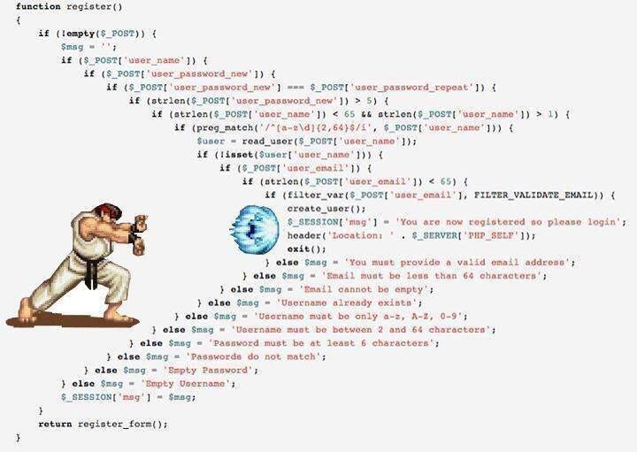

# Liberation


## SUSPECT 1



From [app/Main.hs](app/Main.hs)

```haskell
validateRegistration :: RegRequest -> IO () -> ExceptT String IO ()
validateRegistration r successAction = do
                            usernameExists r
                            passwordExists r
                            matchingPasswords r
                            pwLengthValid r
                            usernameLengthValid r
                            usernameRegexValid r
                            usernameDoesNotExist r
                            emailExists r
                            emailValidLength r
                            validEmail r
                            lift successAction
```
