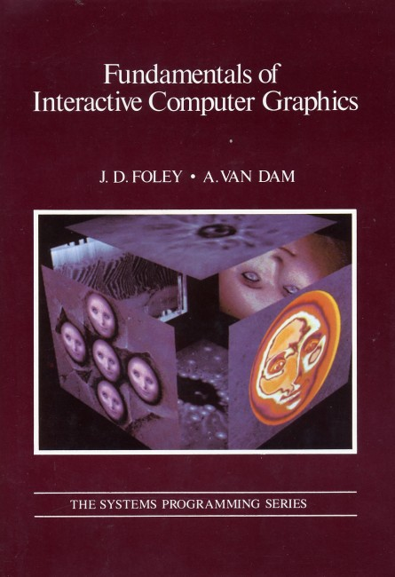

# Yakshaving Coordinate Systems for Affine Transformations in Haskell

A hobby project of mine since this summer has been a [Wolf3D style raycasting engine](https://github.com/adpextwindong/obelisk). I am hoping to replicate [Godbolt's presentation](https://www.youtube.com/watch?v=eOCQfxRQ2pY) all "in-engine" as a sort of developer commentary. This was all inspired by [Fabien Sanglard's Game Engine Black Book on Wolf3d](https://fabiensanglard.net/gebbwolf3d.pdf).

I will be extremely honest. I am not a productive gamedev at all, and at best I'm a mediocre engine grease-monkey. Writing nearly everything from scratch for education purposes has felt extremely labor intensive. With how slow this project has been it might as well be a Bonsai plant for all I care.

Nevertheless it has lead to some productive experiences which my other projects will benefit from. In particular I managed to encode coordinate system transformations at the typelevel.

Why?

Because I am terrible at keeping track of which coordinate space something is in. The type system should do my bidding anyways.

## Preface on the Graphics DSL

Leading up to this I built a small DSL for composing SDL-gfx graphics primitives. This let me build diagrams for how the raycasting engine is actually working.

```haskell
{-# LANGUAGE GADTs #-}

data Graphic a where
    Prim :: Shape Float -> Graphic (Shape Float)
    GroupPrim :: String -> [Graphic (Shape Float)] -> Graphic (Shape Float)
    AffineT :: M22Affine Float -> Graphic a -> Graphic a
    EvaldP :: Shape CInt -> Graphic (Shape CInt)
    EvaldGP :: String -> [Graphic (Shape CInt)] -> Graphic (Shape CInt)
```


It uses GADTs to maintain a distinction between evaluated screen render ready graphics and to be evaluated graphics. (This handles a SDL2 rendering detail which I dont like exposing here but its good enough for government work as my dad would say.)

The AffineT constructor is where the magic happens as it allows me to compose diagrams of whats going on in world space and apply Affine Transformations to project them into screen space coordinates.

This let me write pure DebugUI graphics that are composable too, independent of any screen details as long as I'd handle that conversion later.

## The beef

This worked well enough for my tastes until I would take a break from the project for a while and come back confused as to which coordinate space I'm working in.



I impulse bought this book recently and it made me realize I could annotate my Affine Transformations with coordinate space types.

Now I believe comments shouldn't act in replacement of types. If you're reasoning about invariants, in this case which coordinate system you're _working_ in, then _idealy_ they should be leveraged at the typelevel to prevent fuckups.

### Language Extension Land

A first naive swing would be to use a sum type.

```haskell
data CoordinateSystems = World | Object | NormalizedScreen | PhysicalScreen
```

This is insufficient as we don't want coordinate systems inhabiting the value level for our application. We explicitly want to specific coordinate systems as a type parameter to our matrices/vectors. We want to compose matrices of the same coordinate system ordinarly and then transform between coordinate spaces in a compositional style as if they were functions.

Additionally we want nice error messages.

To address these goals we can introduce a few language extensions, some datatypes, a _DataKind_, a typefamily and a ConstraintKind.

```haskell
{-# LANGUAGE DataKinds #-}
{-# LANGUAGE TypeFamilies #-}
{-# LANGUAGE ConstraintKinds #-}

--Coordinate Spaces
data WorldC
data NDC
data PDC

data CoordinateSystem = 'CoordinateSystem                              --DataKinds is used here

type family KCoordinateSystem' a where                                 --TypeFamilies
    KCoordinateSystem' WorldC = 'CoordinateSystem
    KCoordinateSystem' NDC = 'CoordinateSystem
    KCoordinateSystem' PDC = 'CoordinateSystem

type KCoordinateSystem t = (KCoordinateSystem' t ~ 'CoordinateSystem)  --ConstraintKinds
```

WorldC, NDC, PDC will be the coordinate system types. The KCoordinateSystem ConstraintKind will be the mechanism used to augment the earlier graphics DSL for our purposes. This ConstraintKind leverages type equality (the ~ operator) with the 'CoordinateSystem datakind to provide nice type errors incase we supply a type that isn't a coordinate system according to our KCoordinateSystem' type family.

This may seem a lot at first but the following will clear things up.

```haskell
-- | a and b represent the source coordinate system and target coordinate system the Affine transformation takes you through.
data M22CoordAffine t a b where
    M22CoordAffine :: M22Affine t -> M22CoordAffine t a b

-- | t is the underlying type for the V2/V3's to accomodate converting from Float to CInt eventually
-- | a is the coordinate system (enforced by Lift's ConstraintKind usage)
data HGraphic t a where
    LiftHT :: (KCoordinateSystem a, KCoordinateSystem b) => M22CoordAffine t a b -> HGraphic t (a -> b)
    ApTransform :: HGraphic t (a -> b) -> HGraphic t a -> HGraphic t b
    Compose :: HGraphic t (a -> b) -> HGraphic t (b -> c) -> HGraphic t (a -> c)
```

M22CoordAffine augments the pre-existing M22Affine matrix type with our new coordinate spaces.

The HGraphic GADT is where the action happens.

```haskell
LiftHT :: (KCoordinateSystem a, KCoordinateSystem b) => M22CoordAffine t a b -> HGraphic t (a -> b)
```

LiftHT lifts a coordinate spaced matrix into the graphics DSL similar to AffineT. (The ConstraintKind also ensures we can only lift Matrices with valid coordinate space types)

The crucial difference is that the second type parameter of HGraphic becomes a function from coordinate space a to coordinate space b. Compose then leverages this.

```haskell
Compose :: HGraphic t (a -> b) -> HGraphic t (b -> c) -> HGraphic t (a -> c)
```

If you squint this type is pretty much

```haskell
(a -> b) -> (b -> c) -> a -> c
```

Which is :t flip (.)

Then we can apply these composed affine transformations onto a graphic in some space to produce a graphic in another space.

```haskell
ApTransform :: HGraphic t (a -> b) -> HGraphic t a -> HGraphic t b
```

An example of this in action:

```haskell
foo :: M22CoordAffine Float WorldC NDC
foo = M22CoordAffine m22AffineIdD :: M22CoordAffine Float WorldC NDC

bar :: M22CoordAffine Float NDC PDC
bar = M22CoordAffine m22AffineIdD :: M22CoordAffine Float NDC PDC

worldToPhys :: HGraphic Float (WorldC -> PDC)
worldToPhys = Compose (LiftHT foo) (LiftHT bar)
```

An example of illtyped composition failing to type check:

```haskell
quux = Compose (LiftHT bar) (LiftHT foo)
```

```
• Couldn't match type ‘WorldC’ with ‘PDC’
  Expected type: HGraphic Float (PDC -> NDC)
    Actual type: HGraphic Float (WorldC -> NDC)
```

## A lighter alternative

While I haven't ported my game to this new system yet. I have utilized [Data.Tagged](https://hackage.haskell.org/package/tagged-0.8.6.1/docs/Data-Tagged.html) to phantom type pre-existing matrices I have laying around. Using this isn't too bad other than the coerce's you have to sprinkle in, but its nice documentation and will make porting easier.

```haskell
import Data.Tagged

--Data.Tagged version
type M_World2PhysicalDevice t = Tagged (WorldC -> PDC) (M22Affine t)
type M_PhysicalDevice2World t = Tagged (PDC -> WorldC) (M22Affine t)

type WorldSpace t = Tagged WorldC t
type PhysicalDeviceSpace t = Tagged PDC t
type NormalizedDeviceSpace t = Tagged NDC t
```

## Conclusion

You can see the full source of this idea [here](https://github.com/adpextwindong/obelisk/blob/coordinate-system-demo/src/Obelisk/Math/Hierarchy.hs).

Lingering Questions:

- Is it perfect? No.
- Does it scale? I don't know.
- Does it prevent _me_ from _working_ on _specifc_ bugs I extremely hate? Of course.

To be clear this approach serves as _evidence_ that you're composing Affine Transformations _as intended_. Not neccesarily _proof_ that your matrix math is _correct_.